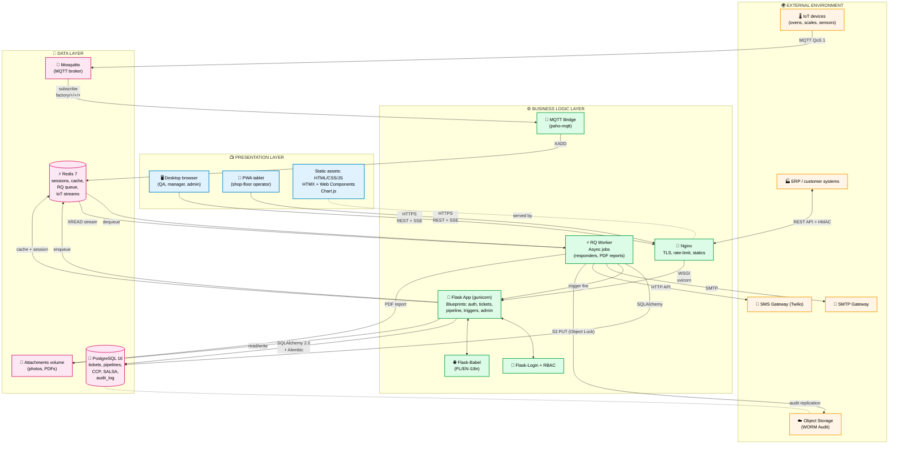
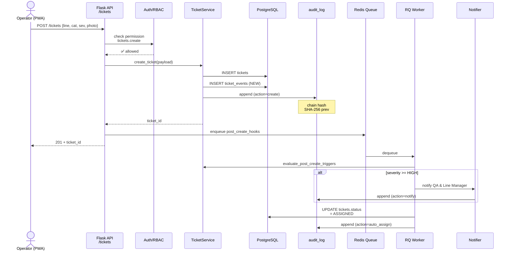
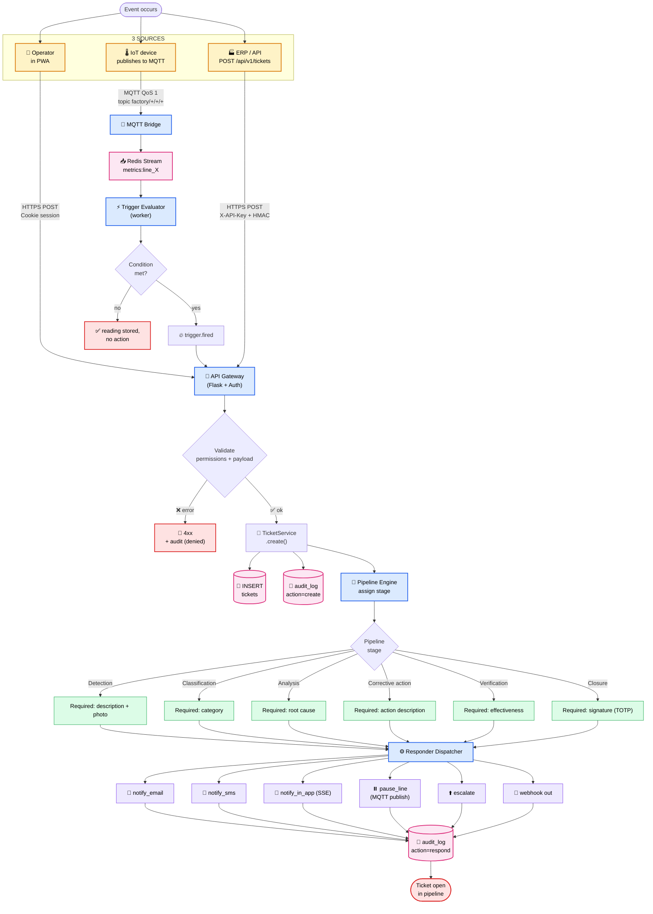
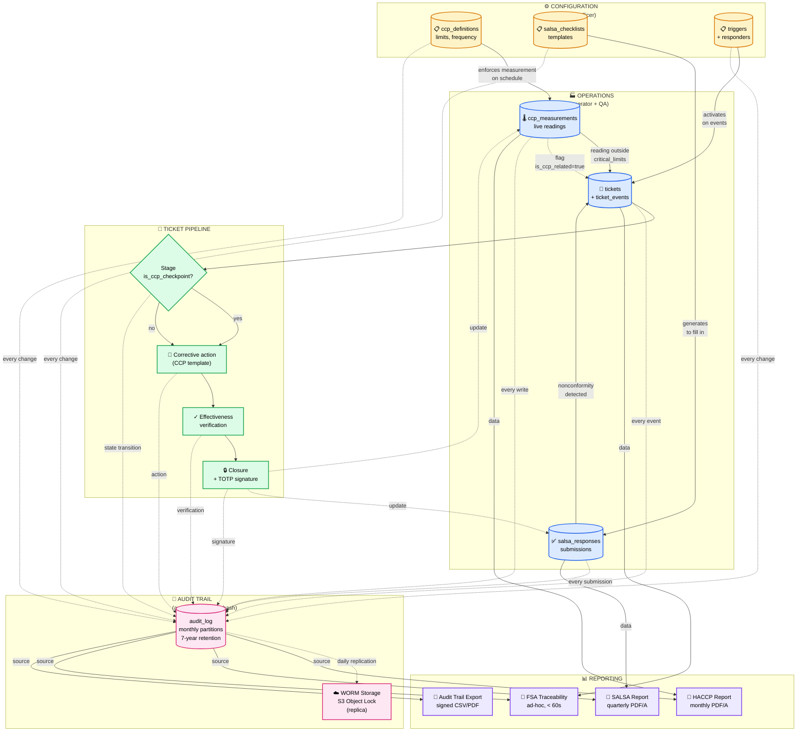
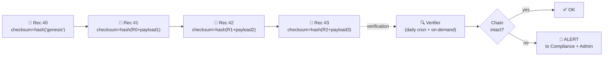
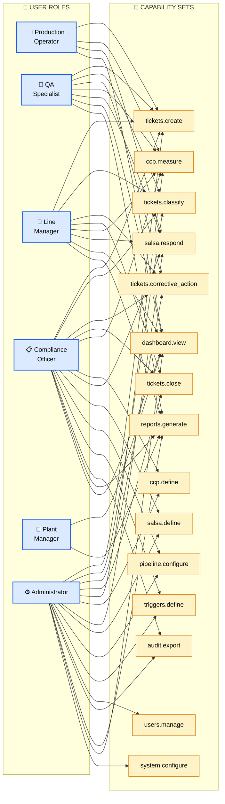
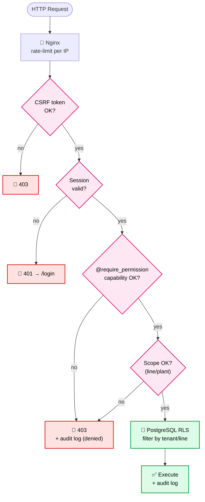
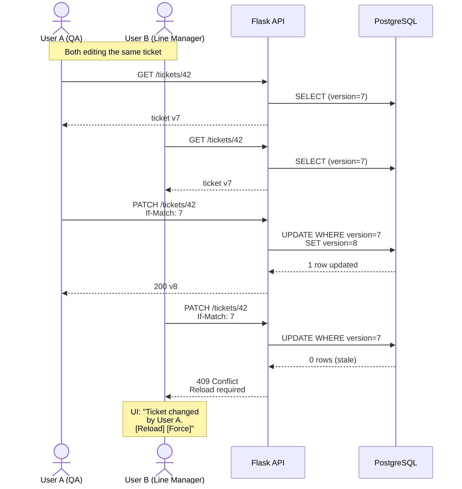
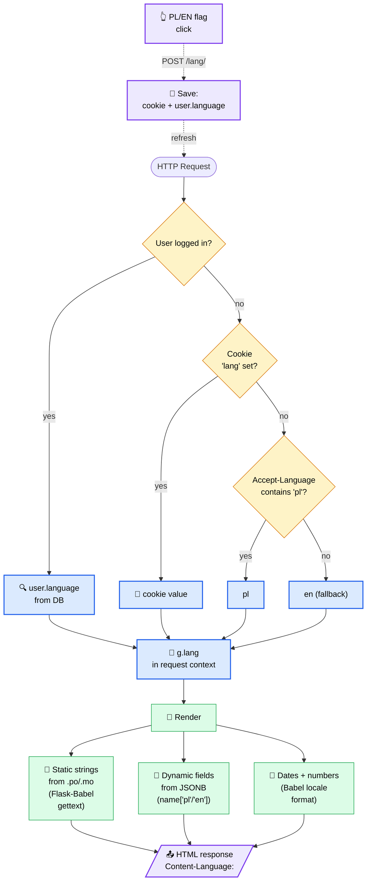
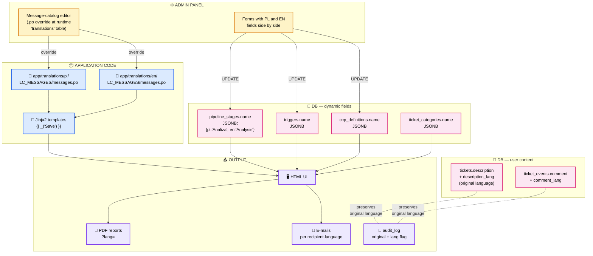

# Architecture diagrams
## Quality Management System (QMS) — UK Bakery

> **Document purpose:** Diagrams ready for direct implementation by the development team. Notation: Mermaid (renders natively in GitHub/GitLab/VS Code) + descriptive tables.
> **Relation:** Companion to `01-architectural-functional-plan.md`.
> **Version:** 1.0 — 2026-04-28

---

## Diagram index

1. [Layered architecture](#diagram-1--layered-architecture)
2. [Ticket data flow](#diagram-2--ticket-data-flow)
3. [Compliance module integration](#diagram-3--compliance-module-integration)
4. [Permissions and roles](#diagram-4--permissions-and-roles)
5. [Multilingual flow (PL/EN)](#diagram-5--multilingual-flow-plen)

---

## Diagram 1 — Layered architecture

**Role:** Shows the three-tier split of the system (presentation / business logic / data) together with the protocols between layers and the integration points with external systems (IoT devices, ERP, e-mail/SMS).
**Relation:** Foundation for every other diagram. Diagram 2 details the data flow inside the business-logic layer, Diagram 3 shows the compliance modules located in the application layer, Diagrams 4 and 5 describe cross-cutting mechanisms (auth, i18n) that touch all three layers.



### Implementation notes

| Point | Configuration |
|---|---|
| Nginx → Flask | `proxy_pass http://gunicorn:8000;` + `proxy_set_header X-Forwarded-For ...` |
| Gunicorn | 4 workers `uvicorn.workers.UvicornWorker`, timeout 30s, graceful restart |
| SSE | Endpoint `/events/stream` per user, Last-Event-ID for resume |
| MQTT topic schema | `factory/<line_id>/<device_id>/<metric>` (lower_snake) |
| Redis Stream key | `metrics:<line_id>` with MAXLEN ~ 100000 |
| RQ queues | `default`, `notifications`, `reports` (priorities) |

---

## Diagram 2 — Ticket data flow

**Role:** Presents the full path of a single ticket from its source (manual / IoT / API) through the trigger and responder engines to notifications, state changes and audit trail. Shows pipeline decision points and the difference between the normal path (operator-raised ticket) and the alarm path (auto-generated from an IoT anomaly).
**Relation:** Details the business-logic layer of Diagram 1; integrates with Diagram 3 at the "CCP measurement" and "audit log" points; permissions verified at every step per Diagram 4.

### 2.1. Sequence diagram — manual path



### 2.2. Flowchart — multi-source orchestration



### 2.3. Path comparison (normal vs anomaly)

| Step | NORMAL path (operator) | ALARM path (IoT/anomaly) |
|---|---|---|
| 1. Trigger | Manual operator click | Trigger engine detects condition (e.g. T > 220°C / 30s) |
| 2. Auth | User session (Flask-Login) | Internal system event (no user, `created_by_system=true`) |
| 3. Classification | Chosen manually | Automatic from trigger definition |
| 4. Severity | Operator picks | From trigger definition |
| 5. Stage start | `Detection` (waits for QA classification) | `Classification` (already classified), notify QA |
| 6. SLA | Standard per stage | Shortened (`fast_track`) when `severity=critical` |
| 7. Responder | Only `notify_in_app` | `notify_sms` + `notify_email` + optionally `pause_line` |
| 8. Audit | `created_by_user_id=<op>` | `created_by_user_id=NULL`, `metadata.trigger_id=<id>` |

---

## Diagram 3 — Compliance module integration

**Role:** Shows the interplay between the SALSA, HACCP, CCP and Audit Trail modules and their integration points with the main ticket pipeline. Every action in these modules generates an audit_log entry; every nonconformity may create a ticket; every corrective action updates CCP/SALSA state.
**Relation:** The modules described here live in the business-logic layer of Diagram 1; tickets flow through them per Diagram 2; permissions (who may define/fill) follow Diagram 4.



### Compliance integration table

| Module | What it records | Triggers a ticket? | Audit log entry? | In which report |
|---|---|---|---|---|
| **HACCP / CCP** | Limit definitions, parameter readings | Yes — on deviation from critical limits | Yes — every definition change + every reading | HACCP Monthly, FSA Traceability |
| **SALSA** | Checklist templates, submitted responses | Yes — when a "nonconformity" is ticked | Yes — every submission + templates | SALSA Quarterly |
| **Triggers** | Automatic rules over metrics | Yes — automatically | Yes — every fire + definition change | Audit Trail Export |
| **Audit Trail** | Every action in the system | No | — (it is the log itself) | Audit Trail Export, all other reports |

### Tamper-evidence mechanism (audit_log)



---

## Diagram 4 — Permissions and roles

**Role:** Defines six functional roles, their capability set, and the access-control checkpoints in the system. Shows where authorisation is enforced (Flask middleware, view decorator, PostgreSQL RLS policy) and how the system resolves concurrent-edit conflicts (optimistic/pessimistic locking).
**Relation:** Enforced on every API call from Diagram 1; checked before each state transition in Diagram 2; special compliance permissions visible in Diagram 3.

### 4.1. Role and capability diagram



### 4.2. Access-control checkpoints



### 4.3. Multi-user — concurrency control



### 4.4. RBAC summary table

| Capability | Operator | QA | Line Mgr | Compliance | Plant Mgr | Admin |
|---|:-:|:-:|:-:|:-:|:-:|:-:|
| `tickets.create` | ✅ | ✅ | ✅ | ✅ | — | ✅ |
| `tickets.classify` | — | ✅ | ✅ | ✅ | — | ✅ |
| `tickets.corrective_action` | — | ✅ | ✅ | ✅ | — | ✅ |
| `tickets.close` | — | — | ✅ | ✅ | — | ✅ |
| `ccp.measure` | ✅ | ✅ | ✅ | ✅ | — | ✅ |
| `ccp.define` | — | — | — | ✅ | — | ✅ |
| `salsa.respond` | ✅ | ✅ | ✅ | ✅ | — | ✅ |
| `salsa.define` | — | — | — | ✅ | — | ✅ |
| `pipeline.configure` | — | — | — | ✅ | — | ✅ |
| `triggers.define` | — | — | — | ✅ | — | ✅ |
| `users.manage` | — | — | — | — | — | ✅ |
| `audit.export` | — | — | — | ✅ | — | ✅ |
| `reports.generate` | — | ✅ | ✅ | ✅ | ✅ | ✅ |
| `dashboard.view` | scope=line | scope=line | scope=line | global | global | global |
| `system.configure` | — | — | — | — | — | ✅ |

---

## Diagram 5 — Multilingual flow (PL/EN)

**Role:** Shows the complete language lifecycle — from detecting the user's preference, through loading static translations (Babel) and dynamic ones (JSONB in the database), to UI rendering, PDF report generation, and audit_log entries that retain the original description language.
**Relation:** i18n is a cross-cutting feature — touches every layer of Diagram 1, every action of Diagram 2 (messages), every report of Diagram 3, and every screen seen by roles in Diagram 4.

### 5.1. Language detection and switching



### 5.2. Where translations live



### 5.3. Translations in reports and audit

| Element | Render language | Reasoning |
|---|---|---|
| **User UI** | `g.lang` (preference) | Working comfort |
| **Monthly HACCP report** | `?lang=` query param, EN by default for FSA | FSA prefers EN, PL on request |
| **SALSA report** | EN | The SALSA standard is English-language |
| **E-mail notifications** | `recipient.language` | Per recipient |
| **SMS** | `recipient.language` | Per recipient |
| **audit_log.diff** | Original (input language) + `lang` flag | Immutability outweighs translation; UI may translate on demand via translation API (optional) |
| **Audit trail export** | EN (with PL option) | External audits typically run in EN |
| **Per-batch traceability PDF** | EN (FSA) | Regulatory standard |

### 5.4. Code-level integration points (examples)

```python
# ── Language detection (Flask-Babel hook) ────────────────
@babel.localeselector
def select_locale():
    if current_user.is_authenticated and current_user.language:
        return current_user.language
    if 'lang' in request.cookies:
        return request.cookies['lang']
    return request.accept_languages.best_match(['pl', 'en']) or 'en'

# ── Rendering dynamic fields (Jinja2 filter) ─────────────
@app.template_filter('i18n')
def i18n_filter(jsonb_field):
    lang = g.get('lang', 'en')
    return jsonb_field.get(lang) or jsonb_field.get('en') or '—'

# Used in a template:
#   {{ stage.name | i18n }}

# ── Exporting a report with language parameter ──────────
@reports_bp.route('/haccp/monthly.pdf')
def haccp_monthly_pdf():
    lang = request.args.get('lang', 'en')
    with force_locale(lang):
        html = render_template('reports/haccp_monthly.html', ...)
        return weasyprint.HTML(string=html).write_pdf()
```

---

## Appendix — Mapping diagrams to code locations

| Diagram | Components | Suggested locations |
|---|---|---|
| 1 — Layered | The whole structure | `app/__init__.py`, `app/blueprints/`, `docker-compose.yml`, `nginx/` |
| 2 — Tickets | Pipeline, triggers | `app/services/ticket_service.py`, `app/services/trigger_engine.py`, `app/workers/responder_dispatcher.py` |
| 3 — Compliance | HACCP, SALSA, audit | `app/blueprints/haccp/`, `app/blueprints/salsa/`, `app/services/audit.py` |
| 4 — RBAC | Auth | `app/auth/decorators.py`, `app/auth/permissions.py`, `migrations/versions/xxxx_seed_roles.py` |
| 5 — i18n | Babel + JSONB | `babel.cfg`, `app/translations/`, `app/utils/i18n.py`, `app/templates/_partials/lang_switcher.html` |

---

## Next steps

1. **Diagram validation** with the architect and Compliance Officer before Phase 1 starts.
2. **MQTT scheme agreement** with the device vendor (topic taxonomy + payload schema).
3. **Repository setup** including `pyproject.toml` (UV), `Dockerfile`, `docker-compose.yml`.
4. **First Alembic migration** with the tables from section 4 of `01-architectural-functional-plan.md`.
5. **Flask blueprint skeleton** matching the modules from section 2.

---

*Document prepared by the team: System Architect, Python Developer, Food Compliance Specialist (UK), UX/UI Designer.*
