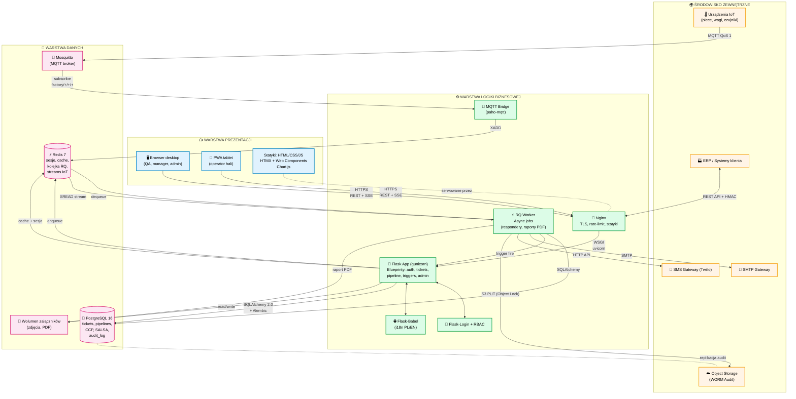
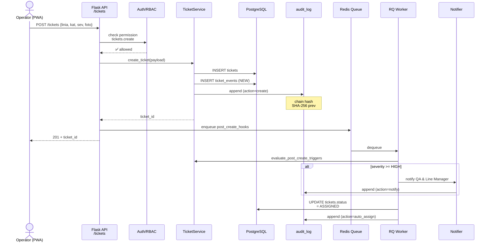
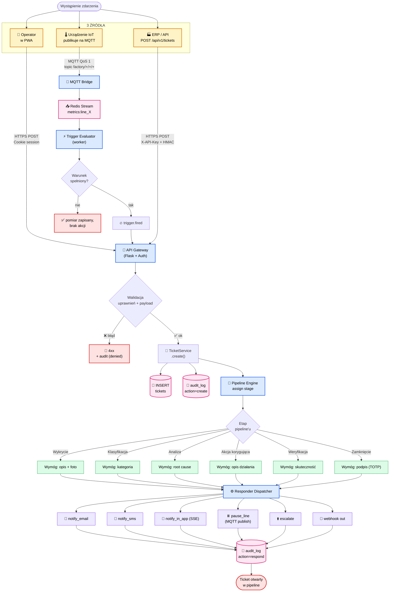
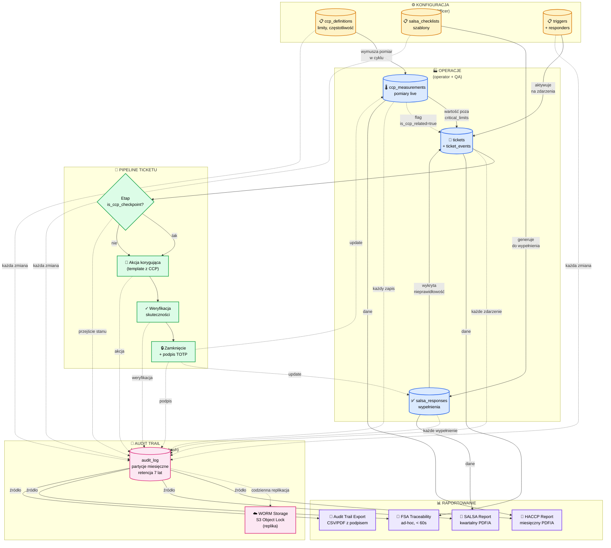
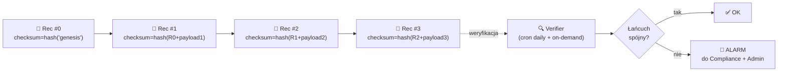
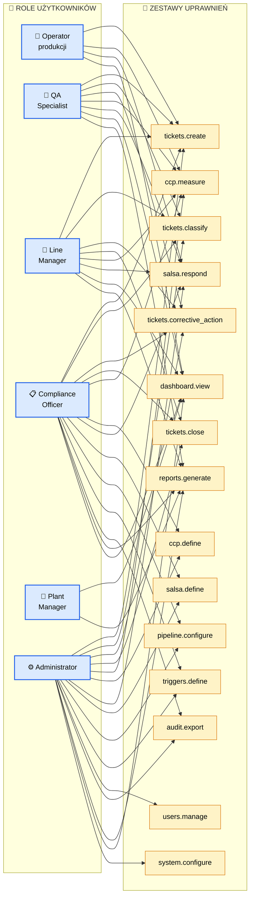
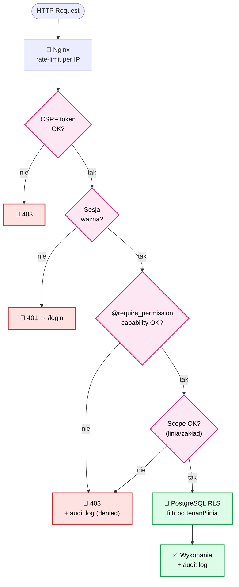
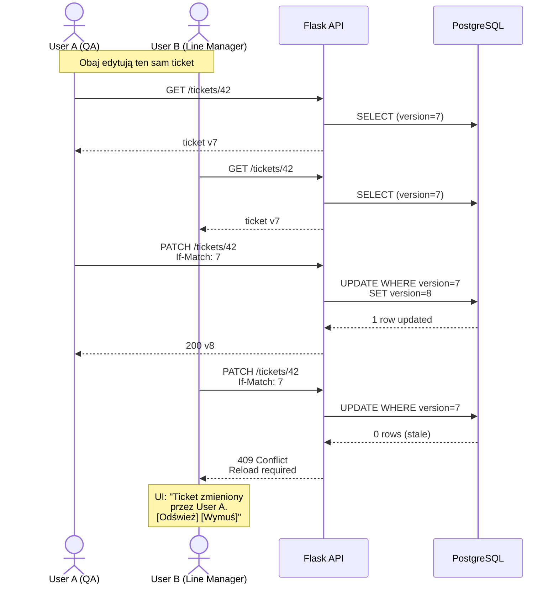
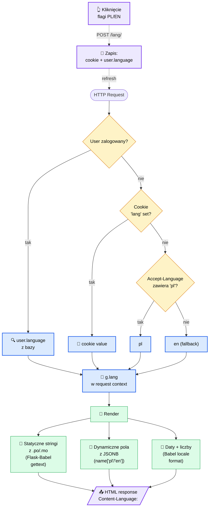
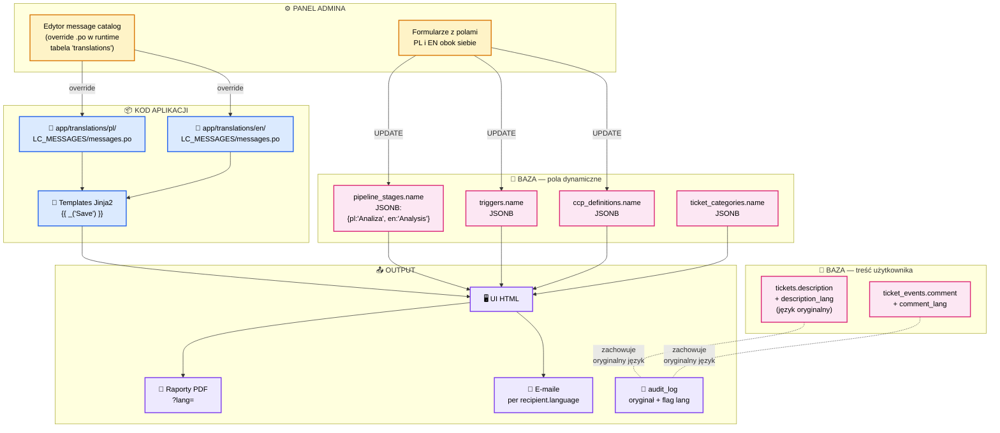

# Diagramy architektury
## System Zarządzania Jakością (QMS) — Piekarnia UK

> **Cel dokumentu:** Diagramy gotowe do bezpośredniej implementacji przez zespół deweloperski. Notacja: Mermaid (renderowanie natywne w GitHub/GitLab/VS Code) + tabele opisowe.
> **Powiązanie:** Stanowi uzupełnienie dokumentu `01-plan-architektoniczny-funkcjonalny.md`.
> **Wersja:** 1.0 — 2026-04-28

---

## Spis diagramów

1. [Architektura warstwowa](#diagram-1--architektura-warstwowa)
2. [Przepływ danych ticketów](#diagram-2--przepływ-danych-ticketów)
3. [Integracja modułów compliance](#diagram-3--integracja-modułów-compliance)
4. [System uprawnień i ról](#diagram-4--system-uprawnień-i-ról)
5. [Przepływ wielojęzyczności (PL/EN)](#diagram-5--przepływ-wielojęzyczności-plen)

---

## Diagram 1 — Architektura warstwowa

**Rola:** Pokazuje trójwarstwowy podział systemu (prezentacja / logika biznesowa / dane) wraz z protokołami komunikacji między warstwami oraz punktami integracji z systemami zewnętrznymi (urządzenia IoT, ERP, e-mail/SMS).
**Powiązanie:** Stanowi punkt wyjścia dla wszystkich pozostałych diagramów. Diagram 2 detalizuje przepływ danych w obrębie warstwy logiki biznesowej, Diagram 3 pokazuje moduły compliance umieszczone w warstwie aplikacyjnej, Diagramy 4 i 5 opisują przekrojowe mechanizmy (auth, i18n) dotykające wszystkich trzech warstw.



### Notatki implementacyjne

| Punkt | Konfiguracja |
|---|---|
| Nginx → Flask | `proxy_pass http://gunicorn:8000;` + `proxy_set_header X-Forwarded-For ...` |
| Gunicorn | 4 workery `uvicorn.workers.UvicornWorker`, timeout 30s, graceful restart |
| SSE | Endpoint `/events/stream` per użytkownik, Last-Event-ID dla resume |
| MQTT topic schema | `factory/<line_id>/<device_id>/<metric>` (lower_snake) |
| Redis Stream key | `metrics:<line_id>` z MAXLEN ~ 100000 |
| RQ queues | `default`, `notifications`, `reports` (priorytety) |

---

## Diagram 2 — Przepływ danych ticketów

**Rola:** Prezentuje pełną drogę pojedynczego ticketu od źródła (manualne / IoT / API) przez silnik triggerów i responderów aż po notyfikacje, aktualizacje stanu i audit trail. Pokazuje punkty decyzyjne pipeline'u oraz różnice między ścieżką normalną (ticket od operatora) a ścieżką alarmową (ticket auto-generowany z anomalii IoT).
**Powiązanie:** Detalizuje warstwę logiki biznesowej z Diagramu 1; integruje się z Diagramem 3 w punktach „pomiar CCP" i „audit log"; uprawnienia weryfikowane na każdym kroku zgodnie z Diagramem 4.

### 2.1. Diagram sekwencyjny — ścieżka manualna



### 2.2. Flowchart — multi-source orchestration



### 2.3. Tabela ścieżek (normal vs anomalia)

| Krok | Ścieżka NORMALNA (operator) | Ścieżka ALARMOWA (IoT/anomalia) |
|---|---|---|
| 1. Trigger | Manualne kliknięcie operatora | Trigger engine wykrywa warunek (np. T > 220°C / 30s) |
| 2. Auth | Sesja użytkownika (Flask-Login) | Wewnętrzny system event (no user, `created_by_system=true`) |
| 3. Klasyfikacja | Wybierana ręcznie | Automatyczna z definicji triggera |
| 4. Severity | Operator wybiera | Z definicji triggera |
| 5. Stage start | `Wykrycie` (czeka na klasyfikację QA) | `Klasyfikacja` (już sklasyfikowane), notify QA |
| 6. SLA | Standardowe per stage | Skrócone (`fast_track`) jeśli `severity=critical` |
| 7. Responder | Tylko `notify_in_app` | `notify_sms` + `notify_email` + opcjonalnie `pause_line` |
| 8. Audit | `created_by_user_id=<op>` | `created_by_user_id=NULL`, `metadata.trigger_id=<id>` |

---

## Diagram 3 — Integracja modułów compliance

**Rola:** Pokazuje współzależności między modułami SALSA, HACCP, CCP i Audit Trail oraz ich punkty integracji z głównym pipeline ticketów. Każda akcja w tych modułach generuje wpis w audit_log; każda niezgodność może utworzyć ticket; każda akcja korygująca aktualizuje stan CCP/SALSA.
**Powiązanie:** Moduły opisane tu są realizowane w warstwie logiki biznesowej z Diagramu 1; tickety przepływają przez nie zgodnie z Diagramem 2; uprawnienia (kto może definiować/wypełniać) zgodne z Diagramem 4.



### Tabela powiązań compliance

| Moduł | Co rejestruje | Wyzwala ticket? | Wpis w audit_log? | W raporcie |
|---|---|---|---|---|
| **HACCP / CCP** | Definicje limitów, pomiary parametrów | Tak — przy odchyleniu od limitów krytycznych | Tak — każda zmiana definicji + każdy pomiar | HACCP Monthly, FSA Traceability |
| **SALSA** | Szablony checklist, odpowiedzi z odpowiedziami | Tak — przy zaznaczeniu „nieprawidłowość" | Tak — każde wypełnienie + szablony | SALSA Quarterly |
| **Triggers** | Reguły automatyczne na metryki | Tak — automatycznie | Tak — każde uruchomienie + zmiana definicji | Audit Trail Export |
| **Audit Trail** | Każda akcja w systemie | Nie | — (sam jest logiem) | Audit Trail Export, wszystkie inne raporty |

### Mechanizm tamper-evidence (audit_log)



---

## Diagram 4 — System uprawnień i ról

**Rola:** Definiuje sześć ról funkcjonalnych, ich uprawnienia (capability set) i punkty kontroli dostępu w systemie. Pokazuje, gdzie autoryzacja jest egzekwowana (middleware Flask, decorator widoku, polityka RLS w PostgreSQL) oraz jak system rozwiązuje konflikty wielu jednoczesnych użytkowników (optimistic/pessimistic locking).
**Powiązanie:** Egzekwowane na każdym wywołaniu API z Diagramu 1; weryfikacja przed każdym przejściem stanu w Diagramie 2; specjalne uprawnienia compliance widoczne w Diagramie 3.

### 4.1. Diagram ról i uprawnień



### 4.2. Punkty kontroli dostępu



### 4.3. Multi-user — kontrola konkurencji



### 4.4. Tabela RBAC w skrócie

| Capability | Operator | QA | Line Mgr | Compliance | Plant Mgr | Admin |
|---|:-:|:-:|:-:|:-:|:-:|:-:|
| `tickets.create` | ✅ | ✅ | ✅ | ✅ | — | ✅ |
| `tickets.classify` | — | ✅ | ✅ | ✅ | — | ✅ |
| `tickets.corrective_action` | — | ✅ | ✅ | ✅ | — | ✅ |
| `tickets.close` | — | — | ✅ | ✅ | — | ✅ |
| `ccp.measure` | ✅ | ✅ | ✅ | ✅ | — | ✅ |
| `ccp.define` | — | — | — | ✅ | — | ✅ |
| `salsa.respond` | ✅ | ✅ | ✅ | ✅ | — | ✅ |
| `salsa.define` | — | — | — | ✅ | — | ✅ |
| `pipeline.configure` | — | — | — | ✅ | — | ✅ |
| `triggers.define` | — | — | — | ✅ | — | ✅ |
| `users.manage` | — | — | — | — | — | ✅ |
| `audit.export` | — | — | — | ✅ | — | ✅ |
| `reports.generate` | — | ✅ | ✅ | ✅ | ✅ | ✅ |
| `dashboard.view` | scope=linia | scope=linia | scope=linia | global | global | global |
| `system.configure` | — | — | — | — | — | ✅ |

---

## Diagram 5 — Przepływ wielojęzyczności (PL/EN)

**Rola:** Pokazuje pełny cykl obsługi języka — od detekcji preferencji użytkownika, przez ładowanie tłumaczeń statycznych (Babel) i dynamicznych (JSONB w bazie), aż po renderowanie UI, generowanie raportów PDF i logowanie zdarzeń w audit_log z zachowaniem oryginalnego języka opisu.
**Powiązanie:** i18n jest cechą przekrojową — dotyka wszystkich warstw z Diagramu 1, każdej akcji z Diagramu 2 (komunikaty), każdego raportu z Diagramu 3 i każdego ekranu z perspektywy ról z Diagramu 4.

### 5.1. Detekcja i przełączanie języka



### 5.2. Lokalizacja danych — gdzie żyją tłumaczenia



### 5.3. Tłumaczenia w raportach i audycie

| Element | Język renderowania | Uzasadnienie |
|---|---|---|
| **UI dla użytkownika** | `g.lang` (preferencja) | Komfort pracy |
| **Raport HACCP miesięczny** | `?lang=` query param, domyślnie EN dla FSA | FSA preferuje EN, ale można generować PL na życzenie |
| **Raport SALSA** | EN | Standard SALSA jest anglojęzyczny |
| **E-mail powiadomienia** | `recipient.language` | Per odbiorca |
| **SMS** | `recipient.language` | Per odbiorca |
| **audit_log.diff** | Oryginał (język wprowadzenia) + flaga `lang` | Niezmienność jest ważniejsza od tłumaczenia; UI w razie potrzeby tłumaczy on-demand przez API tłumaczeń (opcjonalnie) |
| **Eksport audit trail** | EN (z opcją PL) | Audyt zewnętrzny zazwyczaj EN |
| **PDF traceability per batch** | EN (FSA) | Standard regulacyjny |

### 5.4. Implementacja w kodzie (przykładowe punkty integracji)

```python
# ── Detekcja języka (Flask-Babel hook) ───────────────────
@babel.localeselector
def select_locale():
    if current_user.is_authenticated and current_user.language:
        return current_user.language
    if 'lang' in request.cookies:
        return request.cookies['lang']
    return request.accept_languages.best_match(['pl', 'en']) or 'en'

# ── Renderowanie pól dynamicznych (Jinja2 filter) ────────
@app.template_filter('i18n')
def i18n_filter(jsonb_field):
    lang = g.get('lang', 'en')
    return jsonb_field.get(lang) or jsonb_field.get('en') or '—'

# Użycie w szablonie:
#   {{ stage.name | i18n }}

# ── Eksport raportu z parametrem języka ──────────────────
@reports_bp.route('/haccp/monthly.pdf')
def haccp_monthly_pdf():
    lang = request.args.get('lang', 'en')
    with force_locale(lang):
        html = render_template('reports/haccp_monthly.html', ...)
        return weasyprint.HTML(string=html).write_pdf()
```

---

## Załącznik — Mapowanie diagramów na pliki kodu

| Diagram | Komponenty | Sugerowane lokalizacje |
|---|---|---|
| 1 — Warstwowa | Cała struktura | `app/__init__.py`, `app/blueprints/`, `docker-compose.yml`, `nginx/` |
| 2 — Tickety | Pipeline, triggery | `app/services/ticket_service.py`, `app/services/trigger_engine.py`, `app/workers/responder_dispatcher.py` |
| 3 — Compliance | HACCP, SALSA, audit | `app/blueprints/haccp/`, `app/blueprints/salsa/`, `app/services/audit.py` |
| 4 — RBAC | Auth | `app/auth/decorators.py`, `app/auth/permissions.py`, `migrations/versions/xxxx_seed_roles.py` |
| 5 — i18n | Babel + JSONB | `babel.cfg`, `app/translations/`, `app/utils/i18n.py`, `app/templates/_partials/lang_switcher.html` |

---

## Następne kroki

1. **Walidacja diagramów** z architektem i Compliance Officerem przed startem Fazy 1.
2. **Ustalenie schematu MQTT** z dostawcą urządzeń (topic taxonomy + payload schema).
3. **Setup repozytorium** wraz z `pyproject.toml` (UV), `Dockerfile`, `docker-compose.yml`.
4. **Pierwsza migracja Alembic** z tabelami z sekcji 4 dokumentu `01-plan-...`.
5. **Skeleton blueprintów** Flask zgodny z modułami z sekcji 2.

---

*Dokument przygotowany przez zespół: Architekt systemów, Python Developer, Specjalista Compliance Żywności (UK), UX/UI Designer.*
