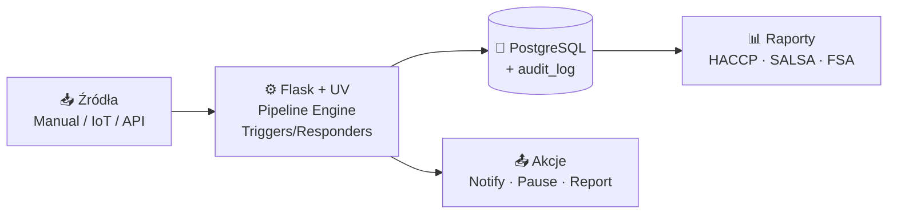

# QMS — System Zarządzania Jakością dla piekarni (UK)

> **Status:** Dokumentacja przed-implementacyjna (v1.0)
> **Stos technologiczny:** Python 3.12 + Flask + UV · PostgreSQL 16 · Redis 7 · MQTT (Mosquitto) · HTML/CSS/JS + HTMX
> **Region regulacyjny:** Wielka Brytania — zgodność z **FSA**, **SALSA**, **HACCP**
> **Tryb pracy:** Multiuser, wielojęzyczny (PL/EN), PWA dla operatorów hali

## Czym jest ten projekt

System Zarządzania Jakością (QMS) dedykowany produkcji żywności w Wielkiej Brytanii — w szczególności piekarnictwu. Rejestruje, klasyfikuje i obsługuje **niezgodności jakościowe** (tickety) z trzech źródeł:

1. **Manualne** — operatorzy zgłaszają z poziomu tabletu na hali
2. **IoT** — automatyczne tickety z urządzeń (czujniki temperatury, wagi) przez MQTT
3. **API** — integracje z ERP, systemami klienta, portalami reklamacyjnymi

Każdy ticket przechodzi przez **konfigurowalny pipeline** etapów (wykrycie → klasyfikacja → analiza → akcja korygująca → weryfikacja → zamknięcie). System silnika reguł (triggery + respondery) automatycznie wykrywa anomalie i uruchamia akcje (powiadomienia, eskalacje, wstrzymanie linii). Wszystko z pełnym audit trail i raportowaniem zgodnym z wymogami FSA.

## Dokumentacja

| # | Dokument | Opis |
|---|---|---|
| 1 | [`01-plan-architektoniczny-funkcjonalny.md`](./01-plan-architektoniczny-funkcjonalny.md) | Pełny plan systemu — architektura, moduły, model bazy, UX, RBAC, plan wdrożenia, ryzyka |
| 2 | [`02-diagramy-architektury.md`](./02-diagramy-architektury.md) | 5 diagramów technicznych (Mermaid): warstwy, przepływ ticketów, compliance, uprawnienia, i18n |

## Kluczowe cechy

- ✅ **Pełna zgodność SALSA + HACCP + FSA** — checklisty, definicje CCP, raporty regulacyjne
- ✅ **Audit trail z chain-hashing** — niezmienialny zapis 7 lat (partycjonowany, replikowany do WORM)
- ✅ **Konfigurowalny pipeline** per linia produkcyjna, wersjonowany
- ✅ **Silnik triggerów** — własny DSL w JSONB, ewaluacja w czasie rzeczywistym z Redis Stream
- ✅ **Multi-source tickety** — manual / IoT / API (HMAC + idempotency)
- ✅ **PWA offline-first** — operator hali pracuje nawet przy zerwanym WiFi
- ✅ **PL/EN** — UI, raporty, e-maile per użytkownik; treści dynamiczne w JSONB

## Diagram szybkiego przeglądu (high-level)



Szczegóły — patrz dokumenty `01-` i `02-`.

## Status implementacji (Faza 1 — MVP)

✅ **Co już działa** (uruchamialne):

- Flask app factory + konfiguracja (UV, `pyproject.toml`)
- Modele SQLAlchemy 2.0: User, Role, Permission, ProductionLine, Pipeline, PipelineStage, Ticket, TicketEvent, AuditLog, CCPDefinition, CCPMeasurement, SalsaChecklist, SalsaResponse, Trigger, Responder, TriggerExecution, InAppNotification
- Auth + RBAC (bcrypt, lockout, dekorator `@require_permission`)
- **2FA TOTP** (pyotp) — wymóg dla ról `admin` i `compliance`
- Tickets: CRUD, state machine, komentarze, transitions z audytem
- **HACCP/CCP** — definicje, pomiary, automatyczne tickety przy odchyleniu od limitów, scoping per linia
- **SALSA checklists** — szablony z bilingwalnymi pozycjami, wypełnianie, automatyczny ticket przy niezgodności
- **Trigger/responder engine** — silnik reguł z JSONB-warunkami, dispatch responderów (notify_in_app, create_ticket, escalate, webhook), tryb `dry_run`
- **REST API** `/api/v1/measurements` z HMAC-SHA256 dla integracji IoT/ERP
- **Panel admina** — przegląd KPI, CRUD użytkowników, toggle triggerów, przeglądarka audit_log z weryfikacją integralności łańcucha
- Audit trail z chain-hashing SHA-256 + weryfikacja łańcucha (tamper-evidence)
- i18n PL/EN przez JSON message catalogs
- Frontend HTML/CSS/JS (Jinja2) — login (z 2FA), dashboard, tickety, HACCP, SALSA, admin
- Seed data: 6 ról, 17 uprawnień, demo linia z pipeline'em + 2 CCP + 2 SALSA + trigger
- **69 testów (pytest)**, wszystkie zielone
- Docker Compose (Postgres 16 + Redis + Mosquitto + app)

⏳ **W planie kolejnych faz** (patrz `01-plan-...` sekcja 8):

- Pipeline configurator (drag-drop UI)
- MQTT Bridge runtime (paho-mqtt → Redis Stream → trigger evaluator)
- RQ worker (asynchroniczne respondery, webhook retry)
- Raporty PDF (HACCP miesięczny, FSA traceability) z WeasyPrint
- Alembic migrations (zamiast `db.create_all()`)
- Form-builder dla triggerów (obecnie: aktywacja/deaktywacja w admin, edycja JSON-em w panelu compliance)
- WebHooks wychodzące + DLQ
- E-mail/SMS respondery (Flask-Mail / Twilio)

## Szybki start (lokalnie, bez Dockera)

```bash
# 1. Wirtualne środowisko + zależności
uv venv --python 3.12
source .venv/bin/activate
uv pip install -e ".[dev]"

# 2. Konfiguracja
cp .env.example .env
# Wygeneruj SECRET_KEY: python -c "import secrets; print(secrets.token_hex(32))"

# 3. Inicjalizacja bazy + seed
export FLASK_APP=app:create_app
flask init-db

# 4. Uruchomienie
flask run
# → http://localhost:5000
# Domyślne konto: admin@local / ChangeMe123!
```

## Szybki start (Docker Compose)

```bash
echo "SECRET_KEY=$(python -c 'import secrets; print(secrets.token_hex(32))')" > .env
docker compose up -d postgres redis
docker compose run --rm app flask init-db
docker compose up app
```

## Testy

```bash
PYTHONPATH=. python3 -m pytest -v
# 69 passed in ~5s
```

Testy używają SQLite in-memory dla szybkości; produkcja — PostgreSQL 16 (patrz `docker-compose.yml`).

## Struktura projektu

```
app/
├── __init__.py            # Flask app factory + blueprint registration
├── extensions.py          # db, login_manager, csrf
├── i18n.py                # PL/EN message catalogs (cookie/header/user-pref)
├── auth.py                # password hashing, RBAC decorator
├── seeds.py               # idempotent seed data
├── models/
│   ├── _base.py           # UUIDPKMixin, TimestampMixin, utcnow
│   ├── auth.py            # User (+ TOTP fields), Role, Permission
│   ├── production.py      # ProductionLine, Pipeline, PipelineStage
│   ├── tickets.py         # Ticket, TicketEvent + state machine
│   ├── haccp.py           # CCPDefinition, CCPMeasurement
│   ├── salsa.py           # SalsaChecklist, SalsaResponse
│   ├── triggers.py        # Trigger, Responder, TriggerExecution, InAppNotification
│   └── audit.py           # AuditLog (chain-hashed, BIGINT PK)
├── services/
│   ├── audit.py           # record(), verify_chain()
│   ├── tickets.py         # create_ticket, transition, list_tickets
│   ├── haccp.py           # record_measurement → auto-ticket on out-of-spec
│   ├── salsa.py           # submit_response → auto-ticket on nonconformity
│   ├── triggers.py        # evaluate(payload) + responder dispatcher
│   └── totp.py            # TOTP enroll/verify, role requirement matrix
├── blueprints/
│   ├── auth.py            # /auth/login (+2FA), /auth/logout, /auth/2fa/*, /auth/lang/<code>
│   ├── dashboard.py       # /
│   ├── tickets.py         # /tickets/*
│   ├── haccp.py           # /haccp/*
│   ├── salsa.py           # /salsa/*
│   ├── admin.py           # /admin/* (users, triggers, audit viewer)
│   └── api.py             # /api/v1/measurements (HMAC), /api/v1/health
├── templates/             # Jinja2 templates per blueprint
├── static/css/app.css     # Hand-written CSS, mobile-first
└── translations/
    ├── pl.json
    └── en.json

tests/                     # pytest (69 tests, SQLite in-memory)
├── test_models.py
├── test_audit.py
├── test_auth.py
├── test_tickets.py
├── test_haccp.py
├── test_salsa.py
├── test_triggers.py       # incl. signed REST API
├── test_admin.py
├── test_totp.py
└── test_i18n.py
```

## Zespół

Dokumentacja przygotowana przez zespół ról:

- 🏗️ **Architekt systemów** — projekt warstw, integracji, skalowania
- 🐍 **Python Developer** — wybór frameworka, struktura blueprintów, ORM
- 🔬 **Specjalista QMS / Compliance UK** — mapowanie wymagań SALSA/HACCP/FSA na funkcje
- 🎨 **UX/UI Designer** — wireframy, zasady projektowe dla hali produkcyjnej

---

*Wersja dokumentacji: 1.0 — 2026-04-28*
