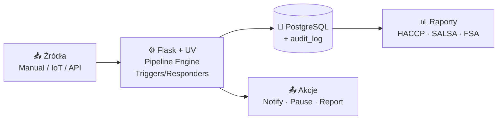

# QMS — System Zarządzania Jakością dla piekarni (UK)

> **Status:** Dokumentacja przed-implementacyjna (v1.0)
> **Stos technologiczny:** Python 3.12 + Flask + UV · PostgreSQL 16 · Redis 7 · MQTT (Mosquitto) · HTML/CSS/JS + HTMX
> **Region regulacyjny:** Wielka Brytania — zgodność z **FSA**, **SALSA**, **HACCP**
> **Tryb pracy:** Multiuser, wielojęzyczny (PL/EN), PWA dla operatorów hali

## Czym jest ten projekt

System Zarządzania Jakością (QMS) dedykowany produkcji żywności w Wielkiej Brytanii — w szczególności piekarnictwu. Rejestruje, klasyfikuje i obsługuje **niezgodności jakościowe** (tickety) z trzech źródeł:

1. **Manualne** — operatorzy zgłaszają z poziomu tabletu na hali
2. **IoT** — automatyczne tickety z urządzeń (czujniki temperatury, wagi) przez MQTT
3. **API** — integracje z ERP, systemami klienta, portalami reklamacyjnymi

Każdy ticket przechodzi przez **konfigurowalny pipeline** etapów (wykrycie → klasyfikacja → analiza → akcja korygująca → weryfikacja → zamknięcie). System silnika reguł (triggery + respondery) automatycznie wykrywa anomalie i uruchamia akcje (powiadomienia, eskalacje, wstrzymanie linii). Wszystko z pełnym audit trail i raportowaniem zgodnym z wymogami FSA.

## Dokumentacja

| # | Dokument | Opis |
|---|---|---|
| 1 | [`01-plan-architektoniczny-funkcjonalny.md`](./01-plan-architektoniczny-funkcjonalny.md) | Pełny plan systemu — architektura, moduły, model bazy, UX, RBAC, plan wdrożenia, ryzyka |
| 2 | [`02-diagramy-architektury.md`](./02-diagramy-architektury.md) | 5 diagramów technicznych (Mermaid): warstwy, przepływ ticketów, compliance, uprawnienia, i18n |

## Kluczowe cechy

- ✅ **Pełna zgodność SALSA + HACCP + FSA** — checklisty, definicje CCP, raporty regulacyjne
- ✅ **Audit trail z chain-hashing** — niezmienialny zapis 7 lat (partycjonowany, replikowany do WORM)
- ✅ **Konfigurowalny pipeline** per linia produkcyjna, wersjonowany
- ✅ **Silnik triggerów** — własny DSL w JSONB, ewaluacja w czasie rzeczywistym z Redis Stream
- ✅ **Multi-source tickety** — manual / IoT / API (HMAC + idempotency)
- ✅ **PWA offline-first** — operator hali pracuje nawet przy zerwanym WiFi
- ✅ **PL/EN** — UI, raporty, e-maile per użytkownik; treści dynamiczne w JSONB

## Diagram szybkiego przeglądu (high-level)



Szczegóły — patrz dokumenty `01-` i `02-`.

## Status implementacji (Faza 1 — MVP)

✅ **Co już działa** (uruchamialne):

- Flask app factory + konfiguracja (UV, `pyproject.toml`)
- Modele SQLAlchemy 2.0: User, Role, Permission, ProductionLine, Pipeline, PipelineStage, Ticket, TicketEvent, AuditLog
- Auth + RBAC (bcrypt, lockout, dekorator `@require_permission`)
- Tickets: CRUD, state machine (NEW → ASSIGNED → IN_PROGRESS → AWAITING_VERIFICATION → CLOSED), komentarze
- Audit trail z chain-hashing SHA-256 + weryfikacja łańcucha
- i18n PL/EN przez JSON message catalogs
- Frontend HTML/CSS/JS (Jinja2) — login, dashboard, lista i szczegół ticketu
- Seed data: 6 ról, 17 uprawnień, demo linia z 6-etapowym pipeline'em
- 26 testów (pytest), wszystkie zielone
- Docker Compose (Postgres 16 + Redis + Mosquitto + app)

⏳ **W planie kolejnych faz** (patrz `01-plan-...` sekcja 8):

- Pipeline configurator (drag-drop UI)
- HACCP/CCP moduł (definicje + pomiary)
- SALSA checklisty
- MQTT Bridge (IoT)
- Trigger engine + respondery (RQ worker)
- Raporty PDF (HACCP miesięczny, FSA traceability)
- Alembic migrations (zamiast `db.create_all()`)
- 2FA (TOTP)

## Szybki start (lokalnie, bez Dockera)

```bash
# 1. Wirtualne środowisko + zależności
uv venv --python 3.12
source .venv/bin/activate
uv pip install -e ".[dev]"

# 2. Konfiguracja
cp .env.example .env
# Wygeneruj SECRET_KEY: python -c "import secrets; print(secrets.token_hex(32))"

# 3. Inicjalizacja bazy + seed
export FLASK_APP=app:create_app
flask init-db

# 4. Uruchomienie
flask run
# → http://localhost:5000
# Domyślne konto: admin@local / ChangeMe123!
```

## Szybki start (Docker Compose)

```bash
echo "SECRET_KEY=$(python -c 'import secrets; print(secrets.token_hex(32))')" > .env
docker compose up -d postgres redis
docker compose run --rm app flask init-db
docker compose up app
```

## Testy

```bash
PYTHONPATH=. python3 -m pytest -v
# 26 passed in ~1.5s
```

Testy używają SQLite in-memory dla szybkości; produkcja — PostgreSQL 16 (patrz `docker-compose.yml`).

## Struktura projektu

```
app/
├── __init__.py            # Flask app factory
├── extensions.py          # db, login_manager, csrf
├── i18n.py                # PL/EN message catalogs
├── auth.py                # password hashing, RBAC decorator
├── seeds.py               # idempotent seed data
├── models/
│   ├── _base.py           # UUIDPKMixin, TimestampMixin
│   ├── auth.py            # User, Role, Permission
│   ├── production.py      # ProductionLine, Pipeline, PipelineStage
│   ├── tickets.py         # Ticket, TicketEvent + state machine
│   └── audit.py           # AuditLog (chain-hashed)
├── services/
│   ├── audit.py           # record(), verify_chain()
│   └── tickets.py         # create_ticket, transition, list_tickets
├── blueprints/
│   ├── auth.py            # /auth/login, /auth/logout, /auth/lang/<code>
│   ├── dashboard.py       # /
│   └── tickets.py         # /tickets/*
├── templates/             # Jinja2 templates
├── static/css/app.css     # Hand-written CSS, mobile-first
└── translations/
    ├── pl.json
    └── en.json

tests/                     # pytest (26 tests, SQLite in-memory)
```

## Zespół

Dokumentacja przygotowana przez zespół ról:

- 🏗️ **Architekt systemów** — projekt warstw, integracji, skalowania
- 🐍 **Python Developer** — wybór frameworka, struktura blueprintów, ORM
- 🔬 **Specjalista QMS / Compliance UK** — mapowanie wymagań SALSA/HACCP/FSA na funkcje
- 🎨 **UX/UI Designer** — wireframy, zasady projektowe dla hali produkcyjnej

---

*Wersja dokumentacji: 1.0 — 2026-04-28*
