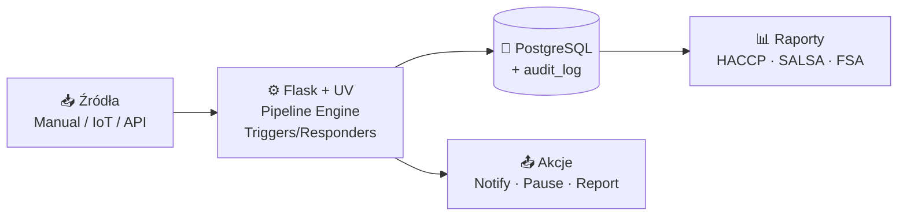

# QMS — System Zarządzania Jakością dla piekarni (UK)

> **Status:** Dokumentacja przed-implementacyjna (v1.0)
> **Stos technologiczny:** Python 3.12 + Flask + UV · PostgreSQL 16 · Redis 7 · MQTT (Mosquitto) · HTML/CSS/JS + HTMX
> **Region regulacyjny:** Wielka Brytania — zgodność z **FSA**, **SALSA**, **HACCP**
> **Tryb pracy:** Multiuser, wielojęzyczny (PL/EN), PWA dla operatorów hali

## Czym jest ten projekt

System Zarządzania Jakością (QMS) dedykowany produkcji żywności w Wielkiej Brytanii — w szczególności piekarnictwu. Rejestruje, klasyfikuje i obsługuje **niezgodności jakościowe** (tickety) z trzech źródeł:

1. **Manualne** — operatorzy zgłaszają z poziomu tabletu na hali
2. **IoT** — automatyczne tickety z urządzeń (czujniki temperatury, wagi) przez MQTT
3. **API** — integracje z ERP, systemami klienta, portalami reklamacyjnymi

Każdy ticket przechodzi przez **konfigurowalny pipeline** etapów (wykrycie → klasyfikacja → analiza → akcja korygująca → weryfikacja → zamknięcie). System silnika reguł (triggery + respondery) automatycznie wykrywa anomalie i uruchamia akcje (powiadomienia, eskalacje, wstrzymanie linii). Wszystko z pełnym audit trail i raportowaniem zgodnym z wymogami FSA.

## Dokumentacja

| # | Dokument | Opis |
|---|---|---|
| 1 | [`01-plan-architektoniczny-funkcjonalny.md`](./01-plan-architektoniczny-funkcjonalny.md) | Pełny plan systemu — architektura, moduły, model bazy, UX, RBAC, plan wdrożenia, ryzyka |
| 2 | [`02-diagramy-architektury.md`](./02-diagramy-architektury.md) | 5 diagramów technicznych (Mermaid): warstwy, przepływ ticketów, compliance, uprawnienia, i18n |

## Kluczowe cechy

- ✅ **Pełna zgodność SALSA + HACCP + FSA** — checklisty, definicje CCP, raporty regulacyjne
- ✅ **Audit trail z chain-hashing** — niezmienialny zapis 7 lat (partycjonowany, replikowany do WORM)
- ✅ **Konfigurowalny pipeline** per linia produkcyjna, wersjonowany
- ✅ **Silnik triggerów** — własny DSL w JSONB, ewaluacja w czasie rzeczywistym z Redis Stream
- ✅ **Multi-source tickety** — manual / IoT / API (HMAC + idempotency)
- ✅ **PWA offline-first** — operator hali pracuje nawet przy zerwanym WiFi
- ✅ **PL/EN** — UI, raporty, e-maile per użytkownik; treści dynamiczne w JSONB

## Diagram szybkiego przeglądu (high-level)

Szczegóły — patrz dokumenty `01-` i `02-`.

## Następne kroki

1. Przegląd dokumentacji przez Compliance Officera oraz architekta.
2. Setup repozytorium: `pyproject.toml` (UV), `Dockerfile`, `docker-compose.yml`.
3. Inicjalna migracja Alembic z tabelami z sekcji 4 dokumentu `01-`.
4. Implementacja Fazy 1 (MVP) zgodnie z planem wdrożenia.

## Zespół

Dokumentacja przygotowana przez zespół ról:

- 🏗️ **Architekt systemów** — projekt warstw, integracji, skalowania
- 🐍 **Python Developer** — wybór frameworka, struktura blueprintów, ORM
- 🔬 **Specjalista QMS / Compliance UK** — mapowanie wymagań SALSA/HACCP/FSA na funkcje
- 🎨 **UX/UI Designer** — wireframy, zasady projektowe dla hali produkcyjnej

---

*Wersja dokumentacji: 1.0 — 2026-04-28*
